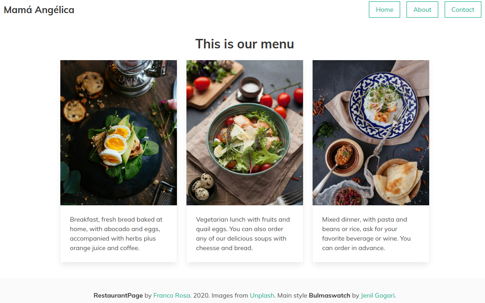

# restaurant-page

> This is a demo page using plain JS to manipulate the DOM.

Although. This project is from [The Odin Project](https://www.theodinproject.com/courses/javascript/lessons/restaurant-page) the restaurant Mamá Angelica is my brother's restaurant. It is an amazing place to stay.


## Live Demo
I will feel honored if you try my app and tell me how to improve it.
it is hosted on a Netlify Free account so be patient, sometimes it takes a while to load.
[restaurant-page](https://mama-angelica.netlify.com)


## Built With

- JavaScript
- HTML, CSS
- Deploy on [Netlify](https://www.netlify.com)

## Deploy
To deploy this project localy, download or clone this repo
1. Use the liveview extension on VScode deploy this project, then open this port on your browser:
```
    http://localhost:5500/dist/
```
2. If you make any changes use webpack to create the _main.js_ file with:
```
    $ npx webpack
```
3. For continuous creation of _main.js_ on any source changes, run:
```
    $ npx webpack --watch
```


## Author

👤 Franco Rosa

- Github: [@FrancoRosa](https://github.com/FrancoRosa)
- Linkedin: [Franco Rosa](https://www.linkedin.com/in/francoro)

## 🤝 Contributing

Contributions, issues and feature requests are welcome!
Feel free to check the [issues page](issues/).

## Show your support

Give a ⭐️ if you like this project!

## Acknowledgments

- [Jenil Gogari](https://jgog.in) for the mod of bulma css framework that I used in this project.
- [Unsplash](https://unsplash.com) for the images I use in this project.
- Team #94 Capricornus Microverse, for the morning code reviews.

## 📝 License

This project is [MIT](lic.url) licensed.